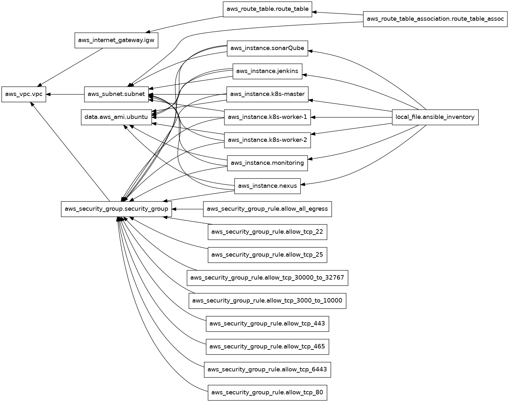

# Seamless CI/CD Pipeline Setup for Cloud Applications

## Introduction
__Seamless CI/CD Pipeline Setup for Cloud Applications__ automates the creation and configuration of cloud infrastructure using Terraform and Ansible. This project sets up a Kubernetes cluster and integrates key DevOps tools like SonarQube, Nexus, Jenkins, Prometheus, and Grafana.

With a fully automated CI/CD pipeline, the project streamlines code updates, continuous testing, and real-time monitoring, ensuring efficient and reliable deployments. This setup enables teams to manage infrastructure as code, promoting rapid application delivery and scalability in cloud environments.

---

## Table of Contents
1. [Architecture](#architecture)
2. [Data Flow](#data-flow)
3. [Technology Stack](#technology-stack)
4. [Infrastructure Setup](#infrastructure-setup)
5. [CI/CD Pipeline](#ci-cd-pipeline)
6. [Monitoring Setup](#monitoring-setup)
7. [Usage Instructions](#usage-instructions)
8. [Conclusion](#conclusion)
9. [Acknowledgments](#acknowledgments)

---
## Architecture

### Architecture Diagram Created with Draw.io

### Architecture Diagram Generated with Terraform Graph

---
## Data Flow
This architecture integrates **Terraform**, **AWS**, **Ansible**, **Kubernetes**, **Jenkins**, **SonarQube**, **Nexus**, **Prometheus**, and **Grafana** to automate CI/CD pipelines and system monitoring.

#### Components:

- **Terraform:** Builds AWS infrastructure (VPC, subnets, route tables, EC2, IGW, security groups).
- **AWS:** Hosts all components within the created infrastructure.
- **Ansible:** Configures servers:
  - Sets up Kubernetes master and worker nodes, initializes `kubeadm`, and configures the network.
  - Installs Prometheus, Grafana, and the Black-box exporter for monitoring.
  - Sets up Nexus (artifact repository) and SonarQube (code analysis) via Docker.
  - Configures Jenkins, installs essential plugins, tools (Docker, kubectl, Trivy), and automates Kubernetes authentication.
- **Kubernetes:** Orchestrates containerized workloads; Jenkins deploys apps to the cluster.
- **Jenkins:** Automates the CI/CD pipeline, integrates with SonarQube for code analysis, pushes artifacts to Nexus, deploys apps to Kubernetes, and integrates with Prometheus for monitoring.
- **Prometheus & Grafana:** Prometheus collects system metrics; Grafana visualizes real-time performance data.
- **Black-box Exporter:** Monitors external website availability for Grafana visualization.

---

## Technology Stack
List the tools and technologies used in the project, e.g.:
- **Terraform** for infrastructure as code (IaC)
- **Ansible** for configuration management
- **Kubernetes** for container orchestration
- **Jenkins** for CI/CD pipeline automation
- **SonarQube**, **Nexus**, **Prometheus**, **Grafana** for DevOps monitoring and code quality

---

## Infrastructure Setup
### Terraform Configuration
**Terraform** provisions the infrastructure on AWS, creating a **VPC**, public **subnet**, **routing table**, **Internet Gateway (IGW)**, **security groups**, and **EC2 instances**.

Each **EC2 instance** is configured based on its role: Kubernetes master, worker nodes, Jenkins, Nexus, SonarQube, Prometheus, and Grafana.

### Ansible Playbooks
**Ansible** is used for configuring the servers, setting up the Kubernetes cluster (master and workers), and deploying all necessary services like Jenkins, Prometheus, Grafana, Nexus, and SonarQube.

---

## CI/CD Pipeline
### Jenkins Pipeline Overview

The Jenkins pipeline automates the entire CI/CD process for a Java-based application, covering everything from code checkout to deployment in Kubernetes. Below is an overview of the key stages:

1. **Tools Configuration:**  
   Uses **JDK 17**, **Maven 3**, and **SonarQube Scanner** for building and analyzing the code.

2. **Git Checkout:**  
   Pulls the source code from the `main` branch of the GitHub repository.

3. **Compilation & Testing:**  
   Compiles the code and runs unit tests using **Maven**.

4. **Security Scans:**  
   Scans both the file system and Docker images for vulnerabilities using **Trivy**.

5. **SonarQube Analysis:**  
   Performs code quality analysis using **SonarQube** and checks for code issues.

6. **Artifact Publishing:**  
   Publishes the build artifacts (e.g., JAR files) to **Nexus**.

7. **Docker Image Build & Push:**  
   Builds a **Docker** image and pushes it to a registry.

8. **Kubernetes Deployment:**  
   Deploys and updates the application in a **Kubernetes** cluster.

9. **Verification:**  
   Verifies that the deployment is successful by checking the **Pods** and **Services**.

This pipeline automates code management, security checks, artifact storage, and deployment, ensuring a streamlined and efficient CI/CD workflow.

---

## Monitoring Setup
- Overview of the monitoring tools and their integration (Jenkins monitoring, black-box exporter)
- Diagram of the monitoring flow

---

## Usage Instructions
- Prerequisites (e.g., tools, environment setup)
- How to clone the repository
- Steps to deploy the infrastructure and run the playbooks
- How to run and manage the CI/CD pipeline
- How to access monitoring dashboards

---

## Conclusion
A brief summary of the project’s outcomes and potential future enhancements.

---

## Steps to run the project
Credits to any resources, libraries, or contributors that helped in the project.
